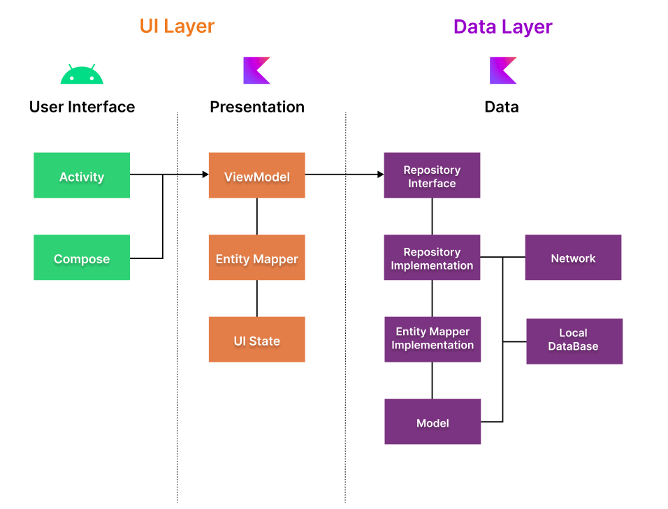
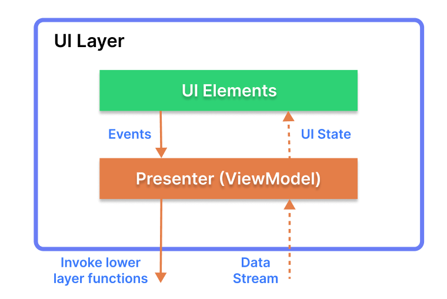

# :lion: Compose ChatGPT Kotlin - Android Chatbot
> _This README is written by Ganesh Divekar

<p align="justify">

Compose ChatGPT Kotlin is an open-source Android chatbot application built using Jetpack Compose and Kotlin programming language. It integrates with OpenAI's GPT-3 API to generate human-like responses to user messages. The app is designed to be easy to use and highly customizable, allowing users to easily integrate the chatbot functionality into their existing projects.

This project showcases the use of modern Android development tools and techniques, including Jetpack Compose for building responsive UIs, Kotlin Coroutines for asynchronous programming, and Dagger Hilt for dependency injection. It also demonstrates how to use the OpenAI GPT-3 API to create a powerful and intelligent chatbot.<br/>

The project has a well-organized folder structure that makes it easy to navigate and understand the codebase. The code is well-documented and follows best practices for clean and maintainable code.<br/>

Overall, Compose ChatGPT Kotlin is a powerful and flexible chatbot solution that can be easily integrated into any Android project. With its modern architecture and powerful features, it is an excellent example of how to build high-quality Android applications using the latest tools and techniques.
</p>

## Screenshots

<p>


</p>


## Requirements
- Android Studio Arctic Fox or later
- OpenAI API Key
- Firebase


## Getting Started

1. Clone the repository.
2. Setup your Firebase and put file ***google-services.json*** into ***app/***
3. Obtain an OpenAI API Key from the OpenAI website.
4. In the ***app/src/main/java/com/chatgptlite/wanted/constants/Constants.kt*** file, add the following line and replace <your-api-key> with your actual API key:
   openAIApiKey=<your-api-key>
5. Build and run the app on an emulator or physical device.

## Directory Structure

```terminal
.
├── app
│   ├── build.gradle
│   ├── proguard-rules.pro
│   ├── src
│   │   ├── androidTest
│   │   ├── main
│   │   │   ├── java/com/chatgptlite/wanted
│   │   │   │   ├── constants
│   │   │   │   ├── data
│   │   │   │   ├── di
│   │   │   │   ├── helpers
│   │   │   │   ├── models
│   │   │   │   ├── ui
│   │   │   │   └── MainActivity.kt
│   │   │   │   └── MainViewModel.kt
│   │   │   ├── res
│   │   │   └── AndroidManifest.xml
│   │   ├── test
│   │   └── ...
├── build.gradle
├── gradle
│   └── wrapper
│       ├── gradle-wrapper.jar
│       └── gradle-wrapper.properties
├── gradle.properties
├── gradlew
├── gradlew.bat
└── settings.gradle
```

The ***app*** directory contains all the source code and resources of the application. It contains a build.gradle file, which is used to configure the build process for the application, and a proguard-rules.pro file, which contains rules for ProGuard, a tool used to shrink and obfuscate code.

Within the ***src*** directory, there are two subdirectories: androidTest and main. The androidTest directory contains integration tests for the application on Android. The main directory contains the majority of the source code and resources for the application, and is further broken down into subdirectories:

- `constants`: This directory contains constant values used throughout the application.
- `data`: This directory contains the data layer of the application, including repositories and data sources.
- `di`: This directory contains the Dependency Injection setup for the application.
- `helpers`: This directory contains utility classes used throughout the application.
- `models`: This directory contains the data models used throughout the application.
- `ui`: This directory contains the user interface components of the application, including Activities, Fragments, and Composables.
- `MainActivity.kt`: This file contains the implementation of the main activity for the application.
- `MainViewModel.kt`: This file contains the implementation of the main view model for the application.

The project also contains other files and directories at the root level, including the build.gradle file, which is used to configure the build process for the entire project, the gradle directory, which contains files related to the Gradle build system, and the gradlew and gradlew.bat scripts, which are used to run Gradle commands. The gradle.properties file contains properties used by the Gradle build system, and the settings.gradle file is used to configure the Gradle settings for the project.

## Features

- [x] New Chat
- [x] Chat History
- [x] ChatBot with ChatGPT
  - [x] stream: true
    - [x] gpt-3.5-turbo
    - [x] text-davinci-003, text-curie-001, text-babbage-001, text-ada-001
  - [ ] stream: false
    - [ ] gpt-3.5-turbo
    - [ ] text-davinci-003, text-curie-001, text-babbage-001, text-ada-001
- [ ] Stop generating
- [ ] Delete conversation
- [ ] Settings for ChatGPT
- [ ] Light/Dart Themes
## 🏛️ Architecture

**ChatGPT Android** follows the [Google's official architecture guidance](https://developer.android.com/topic/architecture).



**ChatGPT Android** was built with [Guide to app architecture](https://developer.android.com/topic/architecture), so it would be a great sample to show how the architecture works in real-world projects.<br>

The overall architecture is composed of two layers; UI Layer and the data layer. Each layer has dedicated components and they each have different responsibilities.
The arrow means the component has a dependency on the target component following its direction.

### Architecture Overview


Each layer has different responsibilities below. Basically, they follow [unidirectional event/data flow](https://developer.android.com/topic/architecture/ui-layer#udf).

### UI Layer



The UI Layer consists of UI elements like buttons, menus, tabs that could interact with users and [ViewModel](https://developer.android.com/topic/libraries/architecture/viewmodel) that holds app states and restores data when configuration changes.

### Data Layer


The data Layer consists of repositories, which include business logic, such as querying data from the local database and requesting remote data from the network. It is implemented as an offline-first source of business logic and follows the [single source of truth](https://en.wikipedia.org/wiki/Single_source_of_truth) principle.<br>


## Modularization


**ChatGPT Android** adopted modularization strategies below:

- **Reusability**: Modulizing reusable codes properly enable opportunities for code sharing and limits code accessibility in other modules at the same time.

- **Parallel Building**: Each module can be run in parallel and it reduces the build time.

- **Decentralized focusing**: Each developer team can assign their dedicated module and they can focus on their own modules.


## 💯 MAD Score


## 🤝 Contribution

Most of the features are not completed except the chat feature, so anyone can contribute and improve this project following the [Contributing Guideline]

## Find this repository useful? 💙
Support it by joining __[stargazers](https://github.com/GaneshajDivekar/ChatGPTCompose_Lite)__ for this repository. :star: <br>
Also, __[follow me](https://github.com/GaneshajDivekar)__ on GitHub for my next creations! 🤩


# License
```xml
Designed and developed by 2023 Ganesh Divekar

Licensed under the Apache License, Version 2.0 (the "License");
you may not use this file except in compliance with the License.
You may obtain a copy of the License at

   http://www.apache.org/licenses/LICENSE-2.0

Unless required by applicable law or agreed to in writing, software
distributed under the License is distributed on an "AS IS" BASIS,
WITHOUT WARRANTIES OR CONDITIONS OF ANY KIND, either express or implied.
See the License for the specific language governing permissions and
limitations under the License.
```
```